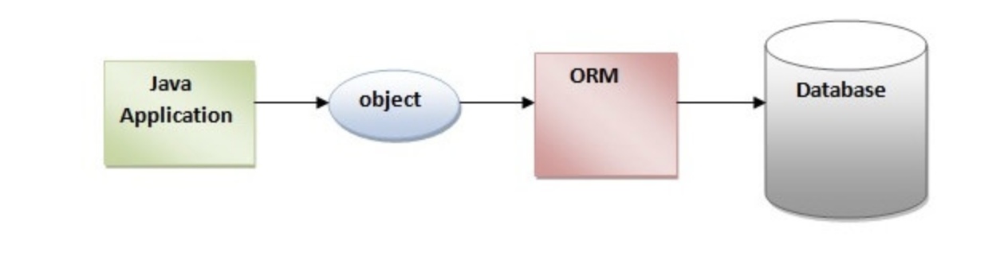

# Hermes: a Spring and Hibernate based Shopping and Ordering system

### Structure of Hermes

### Spring Core

Spring Core

What is dependency?

The other objects that the current class works with.

Inversion of control

Inversion of Control is a principle by which the control of objects is transferred to a container or framework.

Traditionally, each class has the responsibility to manage all the dependencies they leveraged.

### Hibernate

What is Hibernate?
Hibernate is an object-relational mapping tool for the Java programming language which implements the Java Persistence API. 
Hibernate's primary feature is mapping from Java classes to database tables, and mapping from Java data types to SQL data types. Hibernate provides data manipulation facilities.

Associations in Hibernate:

`@ManyToOne` is the most common association, having a direct equivalent in the relational database (e.g. foreign key), and so it establishes a relationship between a child entity and a parent. 

The `@OneToMany` association links a parent entity with one or more child entities.

The `@ManyToMany` association requires a link table that joins two entities.

`@OneToOne` is identical to the @ManyToOne association, as the client-side controls the relationship based on the foreign key column.

Important interfaces of Hibernate framework

`SessionFactory`: SessionFactory is an immutable thread-safe cache of compiled mappings for a single database. We initialize the sessionFactory once and then reuse it. SessionFactory instance is used to get the Session objects for database operations.

`Session`: Session object is the interface between java application code and hibernate framework and provides methods for CRUD operations.

`Transaction`: Transaction is an object used by the application to specify atomic units of work.

### SpringMVC

Spring MVC components

DispatcherServlet(前端控制器)

HandlerMapping(映射处理器): Map a request to a handler that helps the DispatcherServlet to invoke, for example, a controller can be a handler.

**Controller(处理器)**: A component to express request mappings, request input.

**ModelAndView(模型和视图)**: Represents a model and view returned by a handler, to be resolved by the DispatcherServlet.

**ViewResolver(视图解析器)**: a mapping between view names and actual views.

1.首先用户发送请求-->前端控制器(DispatcherServlet), 前端控制器根据请求信息(如URL)来决定选择哪一个控制器进行处理并把请求委托给它. 

2.控制器(controller)接收到请求后, 首先它会在自己内部寻找一个合适的方法来处理请求(用@RequestMapping将方法映射到请求上), 然后传入收到的请求并且调用业务对象进行处理; 处理完毕后返回一个ModelAndView(模型数据和逻辑视图名). '

3.前端控制器根据返回的逻辑视图名, 选择相应的视图进行渲染, 并把模型数据传入以便视图渲染. 

4.前端控制器再次收回控制权, 将响应返回给用户.

### SpringSecurity

What is Spring Security?

Spring Security provides security services for Java EE-based enterprise software applications. There is a particular emphasis on Spring based applications.

**Authentication**

The process of checking credentials and making sure the current logged user is who they claim to be.

**Authorization**

The process of deciding whether a current logged user is allowed to perform an action within your application.

### Microservice

What is microservice?

The microservice architectural style is an approach to developing a single application as a suite of small services, each running in its own process and communicating with lightweight mechanisms, often an HTTP resource API. These services are built around business capabilities and independently deployable by fully automated deployment machinery.

一系列独立的服务共同组成系统

单独部署, 跑在自己的进程里

每个服务为独立的业务开发

How client interact with it: API Gateway(Spring cloud Gateway)

Service discovery: Zookeeper, Spring Cloud eureka

Communication in microservices: Synchronous: RESTful, RPC(Dubbo)

